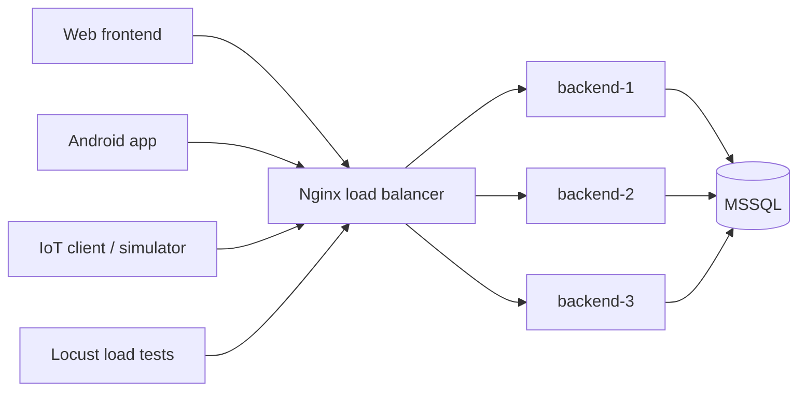

# FreshFridge Backend

FreshFridge backend is a TypeScript/Express API for product freshness monitoring with MSSQL storage and IoT telemetry ingestion.

## Lab 4: Horizontal Scaling

The backend can be scaled horizontally with Docker Compose and Nginx:

- multiple stateless backend replicas;
- one shared MSSQL database;
- Nginx as a load balancer and single API entry point;
- Docker DNS resolution per request so scaled backend containers are reached through the Compose service name;
- web, Android, IoT client, and load tests use the same load balancer URL;
- `/health` and `X-Backend-Instance` show which backend instance handled a request.



## Quick Start

Create `.env` from `.env.example` and set `SA_PASSWORD`, `JWT_ACCESS_SECRET`, and optionally `LB_PORT`.

The database init step also ensures an admin account exists. Override these in `.env` for production:

```env
ADMIN_EMAIL=admin@freshfridge.com
ADMIN_PASSWORD=Admin123!
ADMIN_NAME=Administrator
```

Start 3 backend replicas:

```bash
docker compose -f docker-compose.scaling.yml up --build -d --scale backend=3
docker compose -f docker-compose.scaling.yml restart nginx
```

Check load balancing:

```bash
curl -i http://localhost:3001/health
scripts/check-balancing.bat
```

Stop the stack:

```bash
docker compose -f docker-compose.scaling.yml down
```

## Demo Scripts

Windows:

```bat
scripts\start-scaling-1.bat
scripts\start-scaling-2.bat
scripts\start-scaling-3.bat
scripts\check-balancing.bat
scripts\fault-tolerance-demo.bat
scripts\stop-scaling.bat
```

Linux/macOS:

```bash
sh scripts/start-scaling-1.sh
sh scripts/start-scaling-2.sh
sh scripts/start-scaling-3.sh
sh scripts/check-balancing.sh
sh scripts/fault-tolerance-demo.sh
sh scripts/stop-scaling.sh
```

## Load Testing

Locust test suite:

```bash
pip install locust
locust -f load-tests/locustfile.py --host http://localhost:3001
```

Ready profiles:

```bat
scripts\loadtest-low.bat
scripts\loadtest-medium.bat
scripts\loadtest-high.bat
```

Detailed lab report material is in [docs/lab4-scaling.md](docs/lab4-scaling.md).
