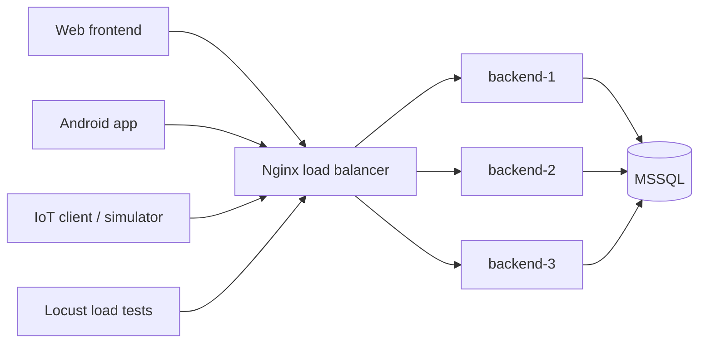

# ЛР4. Горизонтальне масштабування FreshFridge backend

## Стратегія

FreshFridge масштабує backend горизонтально: кілька однакових Node.js/Express контейнерів працюють зі спільною MSSQL базою, а Nginx приймає запити на єдиному порту і балансує їх між backend instances.

## Архітектура

**Figure 2.1 - Architecture Diagram**

```text
Web frontend / Android app / IoT client / Locust
                 |
                 v
        Nginx load balancer
                 |
      +----------+----------+
      |          |          |
  backend-1  backend-2  backend-3
      |          |          |
      +----------+----------+
                 |
               MSSQL
```



Компоненти:

- `nginx` - єдина точка входу, порт `${LB_PORT:-3001}`.
- Nginx використовує Docker DNS resolver `127.0.0.11`, щоб звертатися до scaled service `backend` і розподіляти запити між container IPs.
- `backend` - stateless Express API, масштабується через `--scale backend=N`.
- `db` - спільна MSSQL база з volume `mssql-data`.
- `db-init` - одноразово ініціалізує схему/seed дані перед стартом backend.
- `iot-simulator` - опційний профіль для надсилання телеметрії через load balancer.
- `RUN_SCHEDULER=false` для масштабованих API replicas, щоб фоновий freshness job не виконувався паралельно у кожному контейнері.

## Що робить масштабування можливим

- JWT перевіряється через спільний `JWT_ACCESS_SECRET`, без локальних server sessions.
- Усі backend replicas підключаються до однієї MSSQL бази.
- Backend не публікує host ports, тому кілька контейнерів не конфліктують за порт `3000`.
- `/health` повертає `status`, `instanceId`, `hostname`, `uptime`, `timestamp`, `environment`.
- Кожна відповідь backend містить header `X-Backend-Instance`.

Приклад `/health`:

```json
{
  "status": "ok",
  "instanceId": "backend-2",
  "hostname": "container-id",
  "uptime": 123.45,
  "timestamp": "2026-05-26T10:00:00.000Z",
  "environment": "production"
}
```

## Запуск

Створити `.env` на основі `.env.example` і задати мінімум:

```env
SA_PASSWORD=change_me_StrongPassword123!
JWT_ACCESS_SECRET=change_me
LB_PORT=3001
```

Запуск з одним backend instance:

```bash
docker compose -f docker-compose.scaling.yml up --build -d --scale backend=1
```

Або Windows helper:

```bat
scripts\start-scaling-1.bat
```

Запуск з двома instances:

```bash
docker compose -f docker-compose.scaling.yml up --build -d --scale backend=2
```

```bat
scripts\start-scaling-2.bat
```

Запуск з трьома instances:

```bash
docker compose -f docker-compose.scaling.yml up --build -d --scale backend=3
```

```bat
scripts\start-scaling-3.bat
```

Після зміни кількості replicas можна перезапустити Nginx, щоб він перечитав Docker DNS:

```bash
docker compose -f docker-compose.scaling.yml restart nginx
```

Перевірка:

```bash
curl -i http://localhost:3001/health
```

У відповіді дивитися JSON поле `instanceId` або header `X-Backend-Instance`.

Швидка перевірка балансування для відео:

```bat
scripts\check-balancing.bat
```

Linux/macOS:

```bash
sh scripts/check-balancing.sh
```

Очікування: у виводі кількох запитів видно різні `instanceId` / `hostname`.

**Figure 2.2 - Docker Containers**

Placeholder для скріншота:

- команда `docker compose -f docker-compose.scaling.yml ps`;
- видно `nginx`, `db`, `backend-1`, `backend-2`, `backend-3`;
- видно exposed/published port load balancer `${LB_PORT:-3001}`.

## Web frontend

Web frontend уже використовує `VITE_API_URL=/api`. У Docker Nginx frontend проксить `/api` у `BACKEND_URL`. Для масштабованого backend:

```env
VITE_API_URL=/api
BACKEND_URL=http://localhost:3001
```

На VPS замість localhost вказати адресу load balancer.

## Android frontend

Android app читає API адресу з `BuildConfig.API_BASE_URL`. За замовчуванням це:

```text
http://10.0.2.2:3001/api/
```

Для VPS/load balancer:

```bash
./gradlew :app:assembleDebug -PfreshfridgeApiBaseUrl=https://YOUR_LOAD_BALANCER_HOST/api/
```

## IoT client

ESP32 sketch має `BASE_URL`. Для демонстрації потрібно встановити адресу load balancer:

```cpp
static const char* BASE_URL = "https://YOUR_LOAD_BALANCER_HOST";
```

Telemetry endpoint залишається тим самим:

```text
/api/iot/telemetry
```

Docker IoT simulator можна запустити через профіль:

```bash
docker compose -f docker-compose.scaling.yml --profile iot up -d --scale backend=3
```

## Load testing

Locust сценарій знаходиться в `load-tests/locustfile.py`.

Встановлення:

```bash
pip install locust
```

Запуск UI:

```bash
locust -f load-tests/locustfile.py --host http://localhost:3001
```

Headless запуск:

```bash
locust -f load-tests/locustfile.py --host http://localhost:3001 --headless -u 50 -r 5 -t 2m
```

Готові профілі:

```bat
scripts\loadtest-low.bat
scripts\loadtest-medium.bat
scripts\loadtest-high.bat
```

```bash
sh scripts/loadtest-low.sh
sh scripts/loadtest-medium.sh
sh scripts/loadtest-high.sh
```

Для захищених endpoint задати `AUTH_TOKEN` або `LOGIN_EMAIL` і `LOGIN_PASSWORD`. Для IoT endpoint можна задати `IOT_API_KEY`, або використовувати `AUTH_TOKEN`.

Порівняти однаковий тест для:

- `--scale backend=1`
- `--scale backend=2`
- `--scale backend=3`

Метрики для звіту:

- requests per second;
- average response time;
- failure rate;
- CPU/RAM usage;
- кількість backend instances;
- приклади `X-Backend-Instance` з різних відповідей.

**Figure 2.3 - Load Testing**

Placeholder для скріншота:

- Locust Web UI або headless output;
- Requests/s;
- Avg response time;
- Failures;
- кількість backend replicas у підписі до рисунка.

## Metrics collection

Під час кожного тесту записати таблицю:

| Backend instances | Users | Requests/s | Avg response time | Failure rate | CPU/RAM |
| --- | ---: | ---: | ---: | ---: | --- |
| 1 | 50 |  |  |  |  |
| 2 | 50 |  |  |  |  |
| 3 | 50 |  |  |  |  |

Команди для спостереження:

```bash
docker stats
docker compose -f docker-compose.scaling.yml ps
docker compose -f docker-compose.scaling.yml logs --tail=100 nginx backend
```

У Locust записати `Requests/s`, `Average response time`, `Failures`. У `docker stats` записати CPU та RAM для `backend-*`, `nginx`, `db`.

## Fault tolerance demo

1. Запустити 3 backend instances:

```bash
docker compose -f docker-compose.scaling.yml up --build -d --scale backend=3
```

2. Кілька разів перевірити:

```bash
curl -i http://localhost:3001/health
```

3. Подивитися контейнери:

```bash
docker compose -f docker-compose.scaling.yml ps
```

4. Зупинити один backend container:

```bash
docker stop freshfridge-scaling-backend-1
```

Або запустити готовий helper:

```bat
scripts\fault-tolerance-demo.bat
```

```bash
sh scripts/fault-tolerance-demo.sh
```

5. Повторити `/health` через Nginx і показати, що відповіді продовжують надходити.

6. Переглянути logs:

```bash
docker compose -f docker-compose.scaling.yml logs nginx backend
```

7. Відновити контейнер:

```bash
docker compose -f docker-compose.scaling.yml up -d --scale backend=3
docker compose -f docker-compose.scaling.yml restart nginx
```

**Figure 2.4 - Fault Tolerance Demo**

Placeholder для скріншота:

- `docker compose ps` до зупинки контейнера;
- `docker stop freshfridge-scaling-backend-1`;
- успішний `/health` після зупинки;
- `docker compose ps` після відновлення.

## GitHub readiness

- `.env` не комітиться, він є у `.gitignore`.
- Реальні токени, IP VPS, приватні ключі та паролі не додавати.
- Для прикладів використовувати тільки `.env.example`.
- `docker-compose.scaling.yml` вимагає `SA_PASSWORD` і `JWT_ACCESS_SECRET` з `.env`.
- IoT sketch містить placeholder `https://YOUR_LOAD_BALANCER_HOST`.

## Можливі вузькі місця

- MSSQL залишається спільною точкою навантаження.
- Background freshness scheduler для scaling compose вимкнено на API replicas; для production краще винести його в окремий worker або додати distributed lock.
- Nginx у цьому compose є одна точка входу; для production можна додати окремий VPS-level reverse proxy або managed load balancer.
- Connection pool кожного backend instance збільшує сумарну кількість MSSQL connections.
